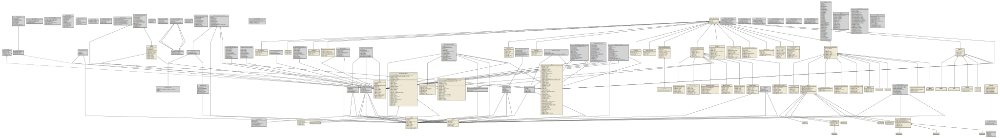

# UML 类图

> 以下 UML 的生成步骤：
> tsuml2 -> mermaid dsl -> UML



---

> mermaid DSL 在 gh pages 上未生效
> 
> 基于 Jekyll 嵌入了脚本方式支持 mermaid，参考自
> https://github.com/xyy94813/github-pages-mermaid-plugin
>
> 支持缩放和拖动查看

浏览器兼容插件时，通过此处查看[mermaid DSL](./uml.mermaid.dsl)

```mermaid

classDiagram

class Map{
            
            +getCenter() LngLat
+setCenter() void
+getBounds() Bounds
+setBounds() void
+getLimitBounds() Bounds
+setLimitBounds() void
+clearLimitBounds() void
+getContainer() HTMLElement
+getSize() Size
+getZooms() [number, number]
+setZooms() void
+getZoom() number
+setZoom() void
+setZoomAndCenter() void
+zoomIn() void
+zoomOut() void
+setFitView() Bounds
+getFitZoomAndCenterByOverlays() [number, LngLat]
+getFitZoomAndCenterByBounds() [number, LngLat]
+getPitch() number
+setPitch() void
+getRotation() number
+setRotation() void
+getStatus() MapStates
+setStatus() void
+getDefaultCursor() string
+setDefaultCursor() void
+getMapStyle() string
+setMapStyle() void
+getCity() void
+setCity() void
+getScale() number
+addLayer() void
+removeLayer() void
+getLayers() BaseLayer~string~[]
+setLayers() void
+add() void
+remove() void
+addControl() void
+removeControl() void
+getAllOverlays() any[]
+getFeatures() string | string[]
+setFeatures() void
+clearMap() void
+clearInfoWindow() void
+destroy() void
+panTo() void
+panBy() void
+lngLatToCoords() [number, number]
+coordsToLngLat() LngLat
+lngLatToContainer() Pixel
+containerToLngLat() LngLat
+coordToContainer() [number, number]
+containerToCoord() [number, number]
+pixelToLngLat() LngLat
+lngLatToPixel() Pixel
+getResolution() number
+getMapApprovalNumber() any
+setMask() void
+setLabelRejectMask() void
+plugin() void
+plugin() void
+resize() void
+getAltitude() number
+getAltitudeByContainer() number
        }
Event~EventType~<|--Map
class MoveToOptions {
            <<type>>
            +duration?: number | AnimationCallback
+speed?: number | AnimationCallback
+easing: EasingCallback
+autoRotation?: boolean
            
        }
class MoveAlongOptions {
            <<type>>
            +duration?: number | AnimationCallback
+speed?: number | AnimationCallback
+easing: EasingCallback
+circlable?: boolean
+delay?: number | AnimationCallback
+aniInterval: number
+autoRotation?: boolean
            
        }
class MoveAnimation {
            <<type>>
            
            +moveTo() void
+moveAlong() void
+startMove() void
+stopMove() void
+pauseMove() void
+resumeMove() void
        }
class Bounds{
            +className: string
+southWest: LngLat
+northEast: LngLat
            +getSouthWest() LngLat
+getNorthEast() LngLat
+getNorthWest() LngLat
+getSouthEast() LngLat
+contains() boolean
+getCenter() LngLat
+toString() string
+toJSON() number[]
+getWidth() number
+getHeight() number
+from() Bounds
        }
Bounds  --  LngLat
Bounds  --  LngLat
class Event~EventType~{
            
            +on() this
+off() this
+emit() this
+hasEvents() boolean
+clearEvents() this
        }
class MapsEvent~EventType~ {
            <<type>>
            +type: EventType
+pixel?: Pixel
+lnglat?: LngLat
+target?: any
            
        }
MapsEvent~EventType~  --  Pixel
MapsEvent~EventType~  --  LngLat
class LngLat{
            +className: string
+lat: number*
+lng: number*
+pos: [number, number]
            +setLng() this
+setLat() this
+getLng() number
+getLat() number
+equals() boolean
+add() LngLat
+subtract() LngLat
+divideBy() LngLat
+multiplyBy() LngLat
+offset() LngLat
+toString() string
+toArray() [number, number]
+toJSON() [number, number]
+distance() number
+distanceTo() number
+from() LngLat
        }
class Pixel{
            +className: string
+x: number
+y: number
            +getX() number
+getY() number
+toString() string
+equals() boolean
+direction() number
+multiplyBy() Pixel
+round() Pixel
+subtract() Pixel
+toArray() [number, number]
+toJSON() [number, number]
        }
class Size{
            +className: string
+width: number
+height: number
            +getWidth() number
+getHeight() number
+toString() string
+toArray() [number, number]
        }
class Control{
            +map: Map
            +addTo() void
+remove() void
+show() void
+hide() void
+removeFrom() void
        }
class ControlPositionObject {
            <<type>>
            +top?: string
+left?: string
+right?: string
+bottom?: string
            
        }
class CommonControlConfig {
            <<type>>
            +position?: ControlPosition
+offset?: [number, number]
            
        }
Event~EventType~<|--Control
Control  --  Map
CommonControlConfig  --  ControlPositionObject
class ControlBar{
            +_config: ControlBarConfig
+_container: HTMLDivElement
+_compass: HTMLDivElement
+_luopan: HTMLDivElement
+_pitchDown: HTMLDivElement
+_pitchUp: HTMLDivElement
+_pointers: HTMLDivElement
+_rotateLeft: HTMLDivElement
+_rotateRight: HTMLDivElement
            
        }
Control<|--ControlBar
ControlBar  --  CommonControlConfig
class HawkEye{
            
            +open() void
+close() void
        }
class HawkEyeOptions {
            <<type>>
            +autoMove?: boolean
+showRectangle?: boolean
+showButton?: boolean
+isOpen?: boolean
+mapStyle?: string
+layers?: any[]
+width?: string
+height?: string
+offset?: [number, number]
+borderStyle?: string
+borderColor?: string
+borderRadius?: string
+borderWidth?: string
+buttonSize?: string
            
        }
Control<|--HawkEye
class MapType{
            +_container: HTMLElement
            +addLayer() void
+removeLayer() void
        }
class MapTypeLayerInfo {
            <<type>>
            +id: string
+enable: string
+name: string
+type: "base" | "overlay"
+layer: BaseLayer~string~
+show: boolean
            
        }
class MapTypeOptions {
            <<type>>
            +defaultType?: number
+showTraffic?: boolean
+showRoad?: boolean
            
        }
Control<|--MapType
class Scale{
            +_container: HTMLElement
            
        }
Control<|--Scale
class ToolBar{
            +_container: HTMLElement
            
        }
Control<|--ToolBar
class BaseLayer~LayerEventType~{
            +CLASS_NAME: string
            +show() void
+hide() void
+setzIndex() void
+getzIndex() number
+setOpacity() void
+getOpacity() number
+getOptions() Object
+getZooms() [number, number]
+setZooms() void
+destroy() void
+setMap() void
+getMap() Map
        }
class CommonLayerOptions {
            <<type>>
            +zooms?: [number, number]
+opacity?: number
+visible?: boolean
+zIndex?: number
            
        }
Event~EventType~<|--BaseLayer~LayerEventType~
class Buildings{
            
            +setStyle() void
        }
BaseLayer~LayerEventType~<|--Buildings
class CanvasLayer{
            
            +setCanvas() void
+getElement() HTMLCanvasElement
+getBounds() Bounds
+setBounds() void
+reFresh() void
        }
BaseLayer~LayerEventType~<|--CanvasLayer
class CustomLayer{
            
            
        }
BaseLayer~LayerEventType~<|--CustomLayer
class DistrictLayer{
            +World: typeof WorldLayer
+Country: typeof CountryLayer
+Province: typeof ProvinceLayer
            +setSOC() void
+setDistricts() void
+getDistricts() any
+setAdcode() void
+setStyles() void
+getStyle() DistrictLayerStyle
        }
class WorldLayer{
            
            
        }
class CountryLayer{
            
            
        }
class ProvinceLayer{
            
            
        }
class DistrictLayerStyle {
            <<type>>
            +stroke-width?: number | Function
+zIndex?: number | Function
+coastline-stroke?: string | Function | string[]
+nation-stroke?: string | Function | string[]
+province-stroke?: string | Function | string[]
+city-stroke?: string | Function | string[]
+county-stroke?: string | Function | string[]
+fill?: string | Function | string[]
            
        }
TileLayer<|--DistrictLayer
DistrictLayer<|--WorldLayer
DistrictLayer<|--CountryLayer
DistrictLayer<|--ProvinceLayer
class GLCustomLayer{
            
            
        }
BaseLayer~LayerEventType~<|--GLCustomLayer
class HeatMap~DataSet~{
            +CLASS_NAME: string
            +setDataSet() void
+getDataSet() DataSet
+addDataPoint() void
+show() void
+hide() void
+setzIndex() void
+getzIndex() number
+setOptions() void
+getOptions() HeatMapOption
+setMap() void
+getMap() Map
        }
class HeatMap3DOptions {
            <<type>>
            +heightScale?: number
+heightBezier?: number[]
+gridSize?: number
            
        }
class HeatMapOption {
            <<type>>
            +radius?: number
+gradient?: Object
+3d?: HeatMap3DOptions
+zooms?: [number, number]
+opacity?: number
+visible?: boolean
+zIndex?: number
+blur?: number
+rejectMapMask?: boolean
+renderOnZooming?: boolean
            
        }
class HeatMapDataSet {
            <<type>>
            +max: number
+data?: any[]
            
        }
Event~EventType~<|--HeatMap~DataSet~
HeatMapOption  --  HeatMap3DOptions
class ImageLayer{
            
            +getImageUrl() string
+setImageUrl() void
+getBounds() Bounds
+setBounds() void
        }
BaseLayer~LayerEventType~<|--ImageLayer
class IndoorMap{
            
            +showIndoorMap() void
+showFloor() void
+showFloorBar() void
+hideFloorBar() void
+showLabels() void
+hideLabels() void
+getSelectedBuildingId() string
+getSelectedBuilding() string
        }
class IndoorMapLayerOptions {
            <<type>>
            +zIndex?: number
+opacity?: number
+cursor?: string
+hideFloorBar?: boolean
            
        }
BaseLayer~LayerEventType~<|--IndoorMap
class LabelsLayer{
            
            +getCollision() boolean
+setCollision() void
+getAllowCollision() boolean
+setAllowCollision() void
+add() void
+remove() void
+getAllOverlays() VectorOverlay[]
+clear() void
        }
BaseLayer~LayerEventType~<|--LabelsLayer
class LayerGroup~Layer~{
            
            +setMap() this
+hasLayer() boolean
+addLayer() void
+addLayers() void
+removeLayer() this
+removeLayers() void
+getLayers() Layer[]
+clearLayers() void
+eachLayer() void
+setOptions() this
+hide() this
+show() this
+reload() this
        }
Event~EventType~<|--LayerGroup~Layer~
class MapboxVectorTileLayer{
            
            +setStyles() void
+getStyles() MapboxVTLayerStyle
+filterByRect() any[]
        }
class CommonStyleOption {
            <<type>>
            +sourceLayer?: string
+injection?: Function | any[]
+visible?: boolean | Function
            
        }
class MapboxVTLayerStyle {
            <<type>>
            +polygon?: PolygonStyle
+line?: LineStyle
+point?: PointStyle
+polyhedron?: PolyhedronStyle
            
        }
BaseLayer~LayerEventType~<|--MapboxVectorTileLayer
MapboxVTLayerStyle  --  CommonStyleOption
MapboxVTLayerStyle  --  CommonStyleOption
MapboxVTLayerStyle  --  CommonStyleOption
MapboxVTLayerStyle  --  CommonStyleOption
class TileLayer{
            +Traffic: typeof TrafficLayer
+Satellite: typeof SatelliteLayer
+RoadNet: typeof RoadNetLayer
+WMS: typeof WMSLayer
+WMTS: typeof WMTSLayer
+Flexible: typeof FlexibleLayer
            +setTileUrl() void
+reload() void
        }
class TrafficLayer{
            
            +stopFresh() void
        }
class SatelliteLayer{
            
            
        }
class RoadNetLayer{
            
            
        }
class WMSLayer{
            
            +setParams() void
+getParams() Object
+setUrl() void
+getUrl() string
        }
class WMTSLayer{
            
            
        }
class FlexibleLayer{
            
            
        }
BaseLayer~LayerEventType~<|--TileLayer
TileLayer<|--TrafficLayer
TileLayer<|--SatelliteLayer
TileLayer<|--RoadNetLayer
TileLayer<|--WMSLayer
WMSLayer<|--WMTSLayer
TileLayer<|--FlexibleLayer
class VectorLayer{
            
            +add() void
+remove() void
+setOptions() void
+has() boolean
+clear() void
+query() VectorOverlay
+getBounds() Bounds
        }
class VectorLayerOption {
            <<type>>
            +visible?: boolean
+zIndex?: number
            
        }
BaseLayer~LayerEventType~<|--VectorLayer
class BezierCurve~ExtractData~{
            
            +getPath() number[][] | number[][][]
+setPath() void
+contains() void
+getLength() number
+getBounds() Bounds
+destroy() void
+setHeight() void
+getPolylineHeight() number
+generateBuffer() any
        }
class BezierCurveOptions~ExtraData~ {
            <<type>>
            +path?: number[][] | number[][][]
+zIndex?: number
+bubble?: boolean
+cursor?: string
+strokeColor?: string
+strokeOpacity?: number
+strokeWeight?: number
+strokeStyle?: string
+borderWeight?: number
+isOutline?: boolean
+outlineColor?: string
+draggable?: boolean
+extData?: ExtraData
            
        }
Overlay~ExtraData,EventType~<|--BezierCurve~ExtractData~
class Circle~ExtraData~{
            
            +getCenter() LngLat
+setCenter() void
+getRadius() number
+setRadius() void
+setCenterAndRadius() void
+destroy() void
+contains() boolean
+getArea() number
+getPlaneHeight() number
        }
class CircleOptions~ExtraData~ {
            <<type>>
            +center?: LngLatLike
+radius?: number
+zIndex?: number
+bubble?: boolean
+cursor?: string
+strokeColor?: string
+strokeOpacity?: number
+strokeWeight?: number
+strokeStyle?: "solid" | "dashed"
+strokeDasharray?: number[]
+fillColor?: string
+fillOpacity?: number
+draggable?: boolean
+extData?: ExtraData
            
        }
Overlay~ExtraData,EventType~<|--Circle~ExtraData~
CircleOptions~ExtraData~  --  LngLat
class CircleMarker~ExtraData~{
            
            +getCenter() LngLat
+setCenter() void
+getRadius() number
+setRadius() void
+contains() boolean
+destroy() void
+getCurAltitude() number
+generateBuffer() any
        }
class CircleMarkerOptions~ExtraData~ {
            <<type>>
            +center?: LngLatLike
+radius?: number
+zIndex?: number
+bubble?: boolean
+cursor?: string
+strokeColor?: string
+strokeOpacity?: number
+strokeWeight?: number
+fillColor?: string
+fillOpacity?: number
+draggable?: boolean
+extData?: ExtraData
            
        }
Overlay~ExtraData,EventType~<|--CircleMarker~ExtraData~
CircleMarkerOptions~ExtraData~  --  LngLat
class ContextMenu{
            
            +open() void
+close() void
+addItem() void
+removeItem() void
+getContent() string | HTMLElement
+setContent() void
        }
class ContextMenuOptions {
            <<type>>
            +position?: LngLatLike
+content?: string | HTMLElement
            
        }
Event~EventType~<|--ContextMenu
ContextMenuOptions  --  LngLat
class ElasticMarker~ExtraData~{
            
            
        }
class ElasticStyleIconStyle {
            <<type>>
            +img?: string
+size?: number[]
+anchor?: string | PixelLike
+imageOffset?: number[]
+imageSize?: number
+fitZoom?: number
+scaleFactor?: number
+maxScale?: number
+minScale?: number
            
        }
class ElasticStyleLabelStyle {
            <<type>>
            +content?: any
+position?: "BL" | "BM" | "BR" | "ML" | "MR" | "TL" | "TM" | "TR"
+offset?: any
+minZoom?: any
            
        }
class ElasticStyle {
            <<type>>
            +icon?: ElasticStyleIconStyle
+label?: ElasticStyleLabelStyle
            
        }
class ElasticMarkerOptions~ExtraData~ {
            <<type>>
            +map?: Map
+position?: LngLatLike
+visible?: boolean
+zIndex?: number
+offset?: PixelLike
+clickable?: boolean
+draggable?: boolean
+bubble?: boolean
+cursor?: string
+topWhenClick?: boolean
+zoomStyleMapping?: Record~string, number~
+extData?: ExtraData
+styles?: ElasticStyle[]
            
        }
Marker~ExtraData~<|--ElasticMarker~ExtraData~
ElasticStyleIconStyle  --  Pixel
ElasticStyle  --  ElasticStyleIconStyle
ElasticStyle  --  ElasticStyleLabelStyle
ElasticMarkerOptions~ExtraData~  --  Map
ElasticMarkerOptions~ExtraData~  --  LngLat
ElasticMarkerOptions~ExtraData~  --  Pixel
ElasticMarkerOptions~ExtraData~  -- "0..*" ElasticStyle
class Ellipse~ExtraData~{
            
            +getCenter() LngLat
+setCenter() void
+getRadius() number
+setRadius() void
+destroy() void
+getArea() number
+contains() boolean
+getPlaneHeight() number
+generateBuffer() any
        }
class EllipseOptions~ExtraData~ {
            <<type>>
            +center?: LngLatLike
+radius?: [number, number]
+zIndex?: number
+bubble?: boolean
+cursor?: string
+strokeColor?: string
+strokeOpacity?: number
+strokeWeight?: number
+strokeStyle?: "solid" | "dashed"
+strokeDasharray?: number[]
+fillColor?: string
+fillOpacity?: number
+draggable?: boolean
+extData?: ExtraData
            
        }
Overlay~ExtraData,EventType~<|--Ellipse~ExtraData~
EllipseOptions~ExtraData~  --  LngLat
class GeoJSON{
            
            +importData() void
+toGeoJSON() Record~string, any~
        }
class GeoJSONOptions {
            <<type>>
            +geoJSON?: GeoJSONFeatureCollection
            +getMarker() Marker~any~
+getPolyline() Polyline~any~
+getPolygon() Polygon~any~
        }
OverlayGroup~OverlayType~<|--GeoJSON
class Icon{
            +CLASS_NAME: string
            +setImageSize() void
+getImageSize() [number, number]
+setSize() void
+getSize() Size | [number, number]
+setImageOffset() void
+getImageOffset() Pixel
+getImage() string
+setImage() void
+setOriginSize() void
+getOriginSize() Size | [number, number]
        }
class IconOptions {
            <<type>>
            +image?: string
+size?: SizeLike
+imageSize?: SizeLike
+imageOffset?: PixelLike
            
        }
IconOptions  --  Size
IconOptions  --  Size
IconOptions  --  Pixel
class InfoWindow{
            
            +open() void
+close() void
+getIsOpen() boolean
+getSize() [number, number]
+setSize() void
+getContent() string | HTMLElement
+setContent() void
+getAnchor() string
+setAnchor() void
        }
class InfoWindowOptions {
            <<type>>
            +isCustom?: boolean
+autoMove?: boolean
+avoid?: number[]
+closeWhenClickMap?: boolean
+content?: string | HTMLElement
+size?: SizeLike
+anchor?: string
+offset?: PixelLike
+position?: LngLatLike
            
        }
Event~EventType~<|--InfoWindow
InfoWindowOptions  --  Size
InfoWindowOptions  --  Pixel
InfoWindowOptions  --  LngLat
class LabelMarker~ExtraData~{
            +moveTo: (targetPosition: LngLatLike, opts?: MoveToOptions) =~ void
+moveAlong: (path: Line, opts?: MoveAlongOptions) =~ void
+startMove: () =~ void
+stopMove: () =~ void
+pauseMove: () =~ void
+resumeMove: () =~ void
            +getName() string
+setName() void
+getPosition() LngLat
+setPosition() void
+getZooms() [number, number]
+setZooms() void
+getOpacity() number
+setOpacity() void
+getzIndex() number
+setzIndex() void
+getRank() number
+setRank() void
+getText() LabelMarkerTextOptions
+setText() void
+getIcon() LabelMarkerIconOptions
+setIcon() void
+setTop() void
+getVisible() boolean
+getCollision() boolean
+getBounds() Bounds
        }
class TextStyleOptions {
            <<type>>
            +fontSize?: number
+fillColor?: string
+strokeColor?: string
+padding?: string | (string | number)[]
+backgroundColor?: string
+borderColor?: string
+borderWidth?: number
+fold?: boolean
            
        }
class LabelMarkerTextOptions {
            <<type>>
            +content?: string
+direction?: string
+offset?: PixelLike
+zooms?: [number, number]
+style?: TextStyleOptions
            
        }
class LabelMarkerIconOptions {
            <<type>>
            +image?: string
+size?: SizeLike
+offset?: PixelLike
+anchor?: string | PixelLike
+clipOrigin: PixelLike
+clipSize: SizeLike
            
        }
class LabelMarkerOptions~ExtraData~ {
            <<type>>
            +name?: string
+position?: LngLatLike
+zooms?: [number, number]
+opacity?: number
+rank?: number
+zIndex?: number
+visible?: boolean
+extData?: ExtraData
+icon?: LabelMarkerIconOptions
+text?: LabelMarkerTextOptions
            
        }
Overlay~ExtraData,EventType~<|--LabelMarker~ExtraData~
MoveAnimation<|..LabelMarker~ExtraData~
LabelMarkerTextOptions  --  Pixel
LabelMarkerTextOptions  --  TextStyleOptions
LabelMarkerIconOptions  --  Size
LabelMarkerIconOptions  --  Pixel
LabelMarkerIconOptions  --  Pixel
LabelMarkerIconOptions  --  Pixel
LabelMarkerIconOptions  --  Size
LabelMarkerOptions~ExtraData~  --  LngLat
LabelMarkerOptions~ExtraData~  --  LabelMarkerIconOptions
LabelMarkerOptions~ExtraData~  --  LabelMarkerTextOptions
class Marker~ExtraData~{
            +CLASS_NAME: string
+moveTo: (targetPosition: LngLatLike, opts?: MoveToOptions) =~ void
+moveAlong: (path: Line, opts?: MoveAlongOptions) =~ void
+startMove: () =~ void
+stopMove: () =~ void
+pauseMove: () =~ void
+resumeMove: () =~ void
            +getPosition() LngLat
+setPosition() void
+getTitle() string
+setTitle() void
+getIcon() string | Icon
+setIcon() void
+getLabel() MarkerLabelOptions
+setLabel() void
+getClickable() boolean
+setClickable() void
+getDraggable() boolean
+setDraggable() void
+getTop() boolean
+setTop() void
+getCursor() string
+setCursor() void
+getAnchor() string | [number, number]
+setAnchor() void
+getOffset() Pixel
+setOffset() void
+getAngle() number
+setAngle() void
+getSize() [number, number]
+setSize() void
+getzIndex() number
+setzIndex() void
+getContent() string | HTMLElement
+setContent() void
+getBounds() Bounds
+remove() void
+getHeight() number
+getMap() Map
+setMap() void
+addTo() void
+add() void
        }
class MarkerLabelOptions {
            <<type>>
            +content?: string | HTMLElement
+direction?: "center" | "top" | "right" | "bottom" | "left"
+offset?: PixelLike
            
        }
class MarkerOptions~ExtraData~ {
            <<type>>
            +map?: Map
+position?: LngLatLike
+content?: string | HTMLElement
+title?: string
+visible?: boolean
+zIndex?: number
+offset?: PixelLike
+anchor?: string | [number, number]
+angle?: number
+clickable?: boolean
+draggable?: boolean
+bubble?: boolean
+zooms?: [number, number]
+cursor?: string
+topWhenClick?: boolean
+height?: number
+extData?: ExtraData
+label?: MarkerLabelOptions
+icon?: string | Icon
+size?: SizeLike
            
        }
Overlay~ExtraData,EventType~<|--Marker~ExtraData~
MoveAnimation<|..Marker~ExtraData~
MarkerLabelOptions  --  Pixel
MarkerOptions~ExtraData~  --  Map
MarkerOptions~ExtraData~  --  LngLat
MarkerOptions~ExtraData~  --  Pixel
MarkerOptions~ExtraData~  --  MarkerLabelOptions
MarkerOptions~ExtraData~  --  Icon
MarkerOptions~ExtraData~  --  Size
class MarkerCluster{
            
            +addData() void
+setData() void
+getClustersCount() number
+getGridSize() number
+setGridSize() void
+getMaxZoom() number
+setMaxZoom() void
+getStyles() MarkerClusterStyle[]
+setStyles() void
+getMap() Map
+setMap() void
+isAverageCenter() boolean
+setAverageCenter() void
        }
class MarkerClusterStyle {
            <<type>>
            +url: string
+size: Size
+offset?: Pixel
+imageOffset?: Pixel
+textColor?: string
+textSize?: number
            
        }
class MarkerClusterOptions {
            <<type>>
            +gridSize?: number
+maxZoom?: number
+averageCenter?: boolean
+clusterByZoomChange?: boolean
+styles?: MarkerClusterStyle[]
            +renderClusterMarker() any
+renderMarker() any
        }
Event~EventType~<|--MarkerCluster
MarkerClusterStyle  --  Size
MarkerClusterStyle  --  Pixel
MarkerClusterStyle  --  Pixel
MarkerClusterOptions  -- "0..*" MarkerClusterStyle
class MassMarks{
            
            +getMap() Map
+setMap() void
+addData() void
+setData() void
+getStyle() MassMarkersStyleOption[]
+setStyle() void
+getOpacity() number
+setOpacity() void
+getzIndex() number
+setzIndex() void
+getZooms() [number, number]
+setZooms() void
+clear() void
        }
class MassMarkersStyleOption {
            <<type>>
            +url?: string
+size?: SizeLike
+anchor?: Pixel
+zIndex?: number
+rotation?: number
            
        }
class MassMarkersOptions {
            <<type>>
            +zIndex?: number
+opacity?: number
+zooms?: [number, number]
+style?: MassMarkersStyleOption | MassMarkersStyleOption[]
            
        }
Event~EventType~<|--MassMarks
MassMarkersStyleOption  --  Size
MassMarkersStyleOption  --  Pixel
MassMarkersOptions  -- "0..*" MassMarkersStyleOption
MassMarkersOptions  -- "0..*" MassMarkersStyleOption
class Overlay~ExtraData,EventType~{
            
            +getMap() Map
+setMap() void
+setExtData() void
+getExtData() ExtraData
+setOptions() void
+getOptions() any
+show() void
+hide() void
+setHeight() void
+getHeight() string | number
        }
Event~EventType~<|--Overlay~ExtraData,EventType~
class OverlayGroup~OverlayType~{
            
            +setMap() this
+addOverlay() void
+addOverlays() void
+getOverlays() OverlayType[]
+hasOverlay() boolean
+removeOverlay() void
+removeOverlays() void
+clearOverlays() void
+eachOverlay() void
+hide() void
+show() void
+setOptions() void
        }
Event~EventType~<|--OverlayGroup~OverlayType~
class Polygon~ExtraData~{
            
            +getPath() LngLat[] | LngLat[][] | LngLat[][][]
+setPath() void
+getExtrusionHeight() number
+setExtrusionHeight() void
+getBounds() Bounds
+destroy() void
+getArea() number
+contains() boolean
+getPlaneHeight() number
        }
class PolygonOptions~ExtraData~ {
            <<type>>
            +path?: PolygonCoords | MultiPolygonCoords
+zIndex?: number
+bubble?: boolean
+cursor?: string
+strokeColor?: string
+strokeOpacity?: number
+strokeWeight?: number
+fillColor?: string
+fillOpacity?: number
+draggable?: boolean
+strokeStyle?: string
+strokeDasharray?: number[]
+zooms?: [number, number]
+height?: number
+extrusionHeight?: number
+roofColor?: string | Function | string[]
+wallColor?: string | Function | string[]
+extData?: ExtraData
+map?: Map
            
        }
Overlay~ExtraData,EventType~<|--Polygon~ExtraData~
PolygonOptions~ExtraData~  --  LngLat
PolygonOptions~ExtraData~  --  LngLat
PolygonOptions~ExtraData~  --  LngLat
PolygonOptions~ExtraData~  --  Map
class Polyline~ExtraData~{
            
            +getPath() LngLat[] | LngLat[][]
+setPath() void
+destroy() void
+getBounds() Bounds
+moveWithPos() void
+getLength() number
+contains() boolean
+getPolylineHeight() number
+getEndDistance() any
+generateBuffer() any
        }
class PolylineOptions~ExtraData~ {
            <<type>>
            +path?: Line | Line[]
+zIndex?: number
+bubble?: boolean
+cursor?: string
+strokeColor?: string
+strokeOpacity?: number
+strokeWeight?: number
+strokeStyle?: string
+strokeDasharray?: number[]
+isOutline?: boolean
+borderWeight?: number
+outlineColor?: string
+lineJoin?: "miter" | "round" | "bevel"
+lineCap?: "round" | "butt" | "square"
+geodesic?: boolean
+showDir?: boolean
+draggable?: boolean
+extData?: ExtraData
+height?: number
+map?: Map
+dirColor?: string
+dirImg?: string | HTMLCanvasElement
+zooms?: [number, number]
            
        }
Overlay~ExtraData,EventType~<|--Polyline~ExtraData~
PolylineOptions~ExtraData~  -- "0..*" LngLat
PolylineOptions~ExtraData~  -- "0..*" LngLat
PolylineOptions~ExtraData~  --  Map
class Rectangle~ExtraData~{
            
            +getBounds() Bounds
+setBounds() void
+destroy() void
+getCenter() LngLat
+contains() boolean
+getArea() number
+getPlaneHeight() number
+generateBuffer() any
        }
class RectangleOptions~ExtraData~ {
            <<type>>
            +bounds?: BoundsLike
+zIndex?: number
+bubble?: boolean
+cursor?: string
+strokeColor?: string
+strokeOpacity?: number
+strokeWeight?: number
+strokeStyle?: "solid" | "dashed"
+strokeDasharray?: number[]
+fillColor?: string
+fillOpacity?: number
+draggable?: boolean
+extData?: ExtraData
+map?: Map
+height?: number
            
        }
Overlay~ExtraData,EventType~<|--Rectangle~ExtraData~
RectangleOptions~ExtraData~  --  Bounds
RectangleOptions~ExtraData~  --  Map
class Text~ExtraData~{
            
            +getText() string
+setText() void
+setStyle() void
        }
class TextOptions~ExtraData~ {
            <<type>>
            +map?: Map
+position?: LngLatLike
+text?: string
+title?: string
+visible?: boolean
+zIndex?: number
+offset?: PixelLike
+anchor?: string | number[]
+angle?: number
+clickable?: boolean
+draggable?: boolean
+bubble?: boolean
+zooms?: [number, number]
+cursor?: string
+topWhenClick?: boolean
+extData?: ExtraData
+style?: Partial~CSSStyleDeclaration~
+content?: string | HTMLElement
+direction?: "center" | "top" | "right" | "bottom" | "left"
            
        }
Marker~ExtraData~<|--Text~ExtraData~
TextOptions~ExtraData~  --  Map
TextOptions~ExtraData~  --  LngLat
TextOptions~ExtraData~  --  Pixel
class BezierCurveEditor{
            
            +setTarget() void
+getTarget() BezierCurve~any~
+open() void
+close() void
        }
class BezierCurveEditorOptions {
            <<type>>
            +createOptions?: BezierCurveOptions
+editOptions?: BezierCurveOptions
+controlPoint?: MarkerOptions
+midControlPoint?: MarkerOptions
+bezierControlPoint?: MarkerOptions
+bezierControlLine?: PolylineOptions
            
        }
Event~EventType~<|--BezierCurveEditor
class CircleEditor{
            
            +setTarget() void
+getTarget() Circle~any~
+open() void
+close() void
        }
class CircleEditorOptions {
            <<type>>
            +createOptions?: CircleOptions
+editOptions?: CircleOptions
+movePoint?: MarkerOptions
+resizePoint?: MarkerOptions
            
        }
Event~EventType~<|--CircleEditor
class EllipseEditor{
            
            +setTarget() void
+getTarget() Ellipse~any~
+open() void
+close() void
        }
class EllipseEditorOptions {
            <<type>>
            +createOptions?: EllipseOptions
+editOptions?: EllipseOptions
+movePoint?: MarkerOptions
+resizeXPoint?: MarkerOptions
+resizeYPoint?: MarkerOptions
            
        }
Event~EventType~<|--EllipseEditor
class MouseTool{
            
            +marker() void
+circle() void
+rectangle() void
+polyline() void
+polygon() void
+measureArea() void
+rule() void
+rectZoomIn() void
+rectZoomOut() void
+close() void
        }
Event~EventType~<|--MouseTool
class PolygonEditor{
            
            +setTarget() void
+getTarget() Polygon~any~
+setAdsorbPolygons() void
+addAdsorbPolygons() void
+removeAdsorbPolygons() void
+clearAdsorbPolygons() void
+open() void
+close() void
        }
class PolygonEditorOptions {
            <<type>>
            +createOptions?: PolygonOptions
+editOptions?: PolygonOptions
+controlPoint?: CircleMarkerOptions
+midControlPoint?: CircleMarkerOptions
            
        }
Event~EventType~<|--PolygonEditor
class PolylineEditor{
            
            +setTarget() void
+getTarget() Polyline~any~
+open() void
+close() void
        }
class PolylineEditorOptions {
            <<type>>
            +createOptions?: PolylineOptions
+editOptions?: PolylineOptions
+controlPoint?: CircleMarkerOptions
+midControlPoint?: CircleMarkerOptions
            
        }
Event~EventType~<|--PolylineEditor
class RangingTool{
            
            +turnOn() void
+turnOff() void
        }
class RangingToolOptions {
            <<type>>
            +startMarkerOptions?: MarkerOptions
+midMarkerOptions?: MarkerOptions
+endMarkerOptions?: MarkerOptions
+lineOptions?: PolylineOptions
+tmpLineOptions?: PolylineOptions
+startLabelText?: string
+midLabelText?: string
+endLabelText?: string
+startLabelOffset?: PixelLike
+midLabelOffset?: PixelLike
+endLabelOffset?: PixelLike
            
        }
Event~EventType~<|--RangingTool
RangingToolOptions  --  Pixel
RangingToolOptions  --  Pixel
RangingToolOptions  --  Pixel
class RectangleEditor{
            
            +setTarget() void
+getTarget() Rectangle~any~
+open() void
+close() void
        }
class RectangleEditorOptions {
            <<type>>
            +createOptions?: RectangleOptions
+editOptions?: RectangleOptions
+southWestPoint?: MarkerOptions
+northEastPoint?: MarkerOptions
            
        }
Event~EventType~<|--RectangleEditor
class Browser {
            <<type>>
            +ua: string
+mobile: boolean
+plat: string
+mac: boolean
+windows: boolean
+ios: boolean
+iPad: boolean
+iPhone: boolean
+android: boolean
+android23: boolean
+chrome: boolean
+firefox: boolean
+safari: boolean
+wechat: boolean
+uc: boolean
+qq: boolean
+ie: boolean
+ie6: boolean
+ie7: boolean
+ie8: boolean
+ie9: boolean
+ie10: boolean
+ie11: boolean
+edge: boolean
+ielt9: boolean
+baidu: boolean
+isLocalStorage: boolean
+isGeolocation: boolean
+mobileWebkit: boolean
+mobileWebkit3d: boolean
+mobileOpera: boolean
+retina: boolean
+touch: boolean
+msPointer: boolean
+pointer: boolean
+baseRender: string
+wasm: boolean
+webkit: boolean
+ie3d: boolean
+webkit3d: boolean
+gecko3d: boolean
+opera3d: boolean
+any3d: boolean
+isCanvas: boolean
+isSvg: boolean
+isVML: boolean
+isWorker: boolean
+isWebsocket: boolean
+isWebGL: boolean
            +checkWebGL() boolean
        }
class DomUtil {
            <<type>>
            
            +getViewport() [number, number]
+getViewportOffset() [number, number]
+create() HTMLElement
+hasClass() boolean
+hasClass() undefined
+hasClass() undefined
+addClass() void
+setClass() void
+removeClass() void
+remove() void
+empty() void
+rotate() void
+setCss() DomUtil
+setOpacity() void
+toggleClass() void
+fillText() HTMLElement
+getStyle() string
+mousePos() any
+watchSize() any
+watchSize2() any
        }
class GeometryUtil {
            <<type>>
            
            +distance() number
+ringArea() number
+ringAreaByAltitude() number
+isClockwise() boolean
+typePolygon() string
+makesureClockwise() Ring
+makesureAntiClockwise() Ring
+distanceOfLine() number
+distanceOfLineByAltitude() number
+distanceLineByAltitude() number
+ringRingClip() [number, number][]
+doesSegmentsIntersect() boolean
+doesSegmentLineIntersect() boolean
+doesSegmentRingIntersect() boolean
+doesSegmentPolygonIntersect() boolean
+doesLineLineIntersect() boolean
+doesLineRingIntersect() boolean
+doesRingRingIntersect() boolean
+pointInRing() boolean
+isPointInRing() boolean
+isPointInBbox() boolean
+isRingInRing() boolean
+isPointInPolygon() boolean
+isPointInPolygons() boolean
+isPointOnSegment() boolean
+isPointOnLine() boolean
+isPointOnRing() boolean
+isPointOnPolygon() boolean
+closestOnSegment() LngLat
+closestOnLine() LngLat
+distanceToSegment() number
+distanceToLine() number
        }
class Util {
            <<type>>
            
            +isDOM() boolean
+colorNameToHex() string
+rgbHex2Rgba() string
+argbHex2Rgba() string
+isEmpty() boolean
+deleteItemFromArray() any
+deleteItemFromArrayByIndex() any
+indexOf() number
+format() number
+isArray() boolean
+includes() boolean
+requestIdleCallback() number
+cancelIdleCallback() void
+requestAnimFrame() number
+cancelAnimFrame() void
        }
```

